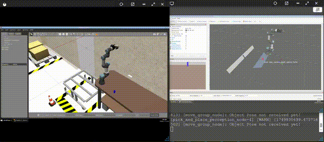

# Manipulation Project

## Overview

This project demonstrates a **Pick and Place** task using the **UR3e robotic arm**, both in simulation and on real hardware. The system integrates **MoveIt2** for motion planning and control, and utilizes a **perception pipeline** with object detection to autonomously locate and manipulate objects. The project supports both **Gazebo simulation** and a **real-world setup** using a UR3e arm with a point cloud camera.

It is designed for ROS 2 and provides modular launch files to run the full pipeline — from object detection to grasp execution — in both environments.

---

<p align="center">
  
  
</p>

## Prerequisites

- ROS 2 Humble
- UR3e Gazebo package for simulation
- Physical **UR3e robot** and a Point Cloud camera for real-world testing
- `MoveIt2`, `colcon`, and `rosdep` installed


## Getting Started

1. Clone this repository into your ROS 2 workspace (`ros2_ws`),    creating it if it doesn't exist:

    ```bash
    mkdir -p ~/ros2_ws/src
    cd ~/ros2_ws/src
    git clone <this-repo-url>
    cd ~/ros2_ws
    ```

2. Install dependencies:
    ```bash
    # Optional: Use if rosdep not initialized
    sudo rosdep init
    rosdep update
    ```
    ```bash
    cd ~/ros2_ws
    rosdep install --from-paths src --ignore-src -r -y
    ```
3. Build the workspace:
    ```bash
    colcon build && source install/setup.bash
    ```

## Running the Pick & Place Task

### Test the Setup

Before running the main Pick and Place task, ensure your environment is correctly configured. Whether you're using **Gazebo simulation** or a **real UR3e robot**, follow these checks after launching the robot's control node (Gazebo or hardware interface).

- Check Active Controllers

    Make sure all required controllers are running:

    ```bash
    ros2 control list_controllers
    ```
    **Expected output:**
    ```
    joint_trajectory_controller[joint_trajectory_controller/JointTrajectoryController] active
    joint_state_broadcaster[joint_state_broadcaster/JointStateBroadcaster] active
    gripper_controller[position_controllers/GripperActionController] active
    ```

- Verify that joint state messages are being published:
    ```bash
    ros2 topic echo /joint_states
    ```
    You should see a stream of messages showing joint positions, velocities, etc.

- Ensure your camera is publishing expected topics:
    ```bash
    ros2 topic list | grep camera
    ```
    This should return a list of camera-related topics (e.g., /camera/color/image_raw, /camera/depth/points, etc.).

### Simulation

Run these commands in seperate terminals.

- Launch the MoveIt2 planning node:
    ```bash
    ros2 launch my_moveit_config move_group.launch.py
    ```

- (Optional) Launch RViz for visualization, also can give commands via Moveit2 plugin:
    ```bash
    ros2 launch my_moveit_config moveit_rviz.launch.py
    ```

- Launch the perception and pick-and-place pipeline:
    ```bash
    ros2 launch moveit2_scripts pick_and_place_perception.launch.py
    ```

### Real Robot

Run these commands in seperate terminals.

- Launch the MoveIt2 planning node:
    ```bash
    ros2 launch real_moveit_config move_group.launch.py
    ```

- (Optional) Launch RViz for visualization, also can give commands via Moveit2 plugin:
    ```bash
    ros2 launch real_moveit_config moveit_rviz.launch.py
    ```

- Launch the perception and pick-and-place pipeline:
    ```bash
    ros2 launch moveit2_scripts pick_and_place_perception_real.launch.py
    ```